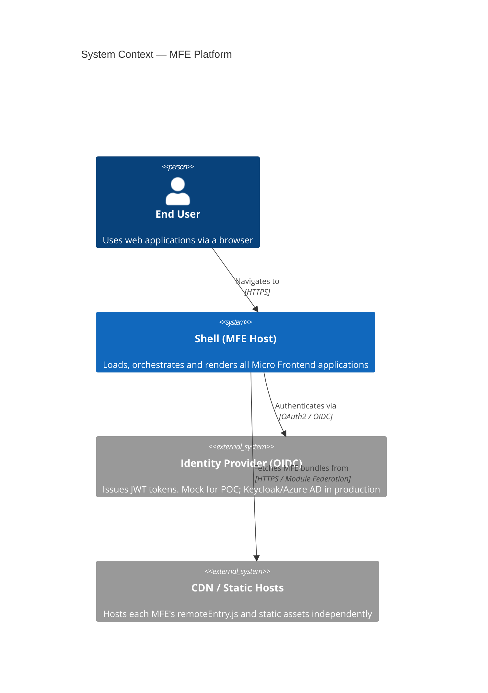
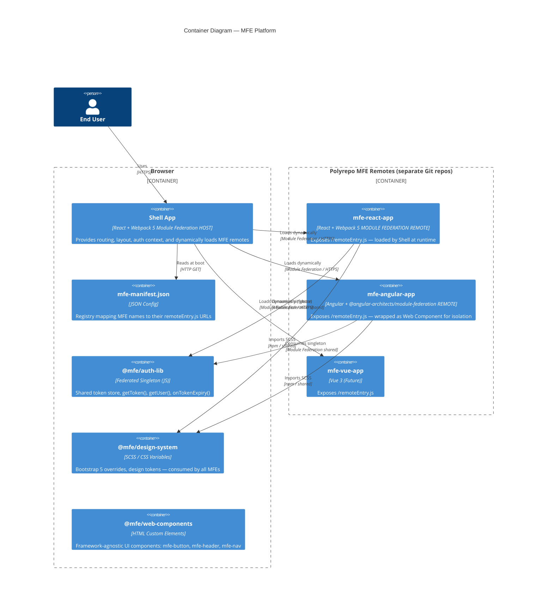
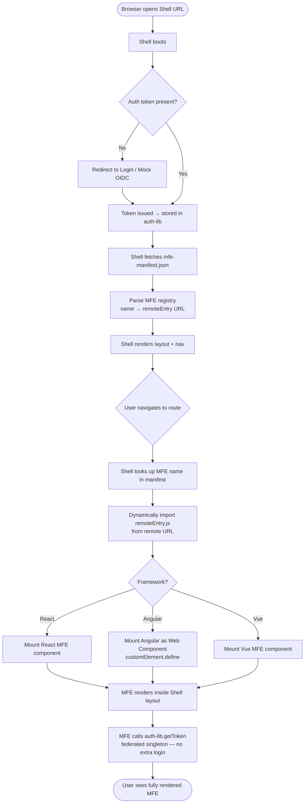
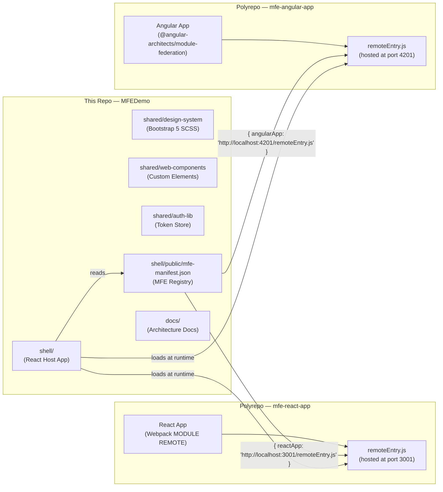
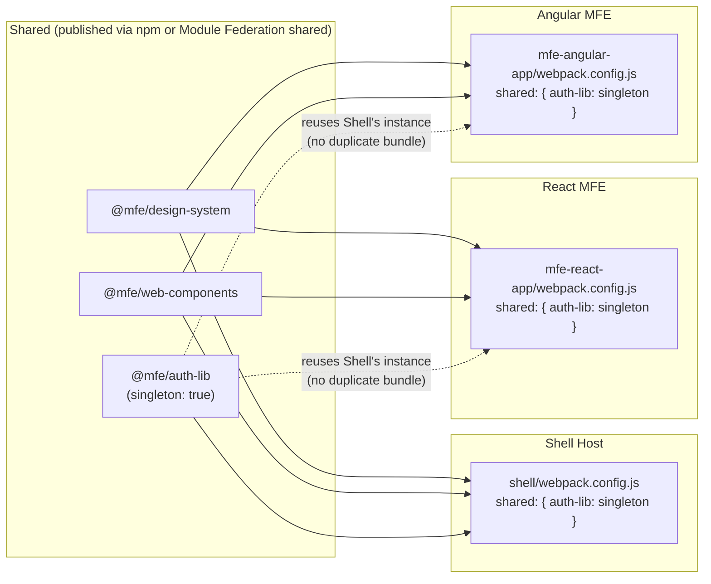

# MFE System — Architecture Overview

> **Scope**: This document describes the high-level system architecture for the MFEDemo POC — a Micro Frontend platform supporting polyrepo isolation, cross-framework composition, shared design system, and shared authentication.

---

## 1. System Context (C4 Level 1)



---

## 2. Container Diagram (C4 Level 2)



---

## 3. High-Level Data Flow



---

## 4. Repository & Deployment Layout



---

## 5. Shared Library Consumption Pattern



---

## 6. Key Principles

| Principle                    | Implementation                                                                         |
| ---------------------------- | -------------------------------------------------------------------------------------- |
| **Polyrepo isolation**       | Each MFE is a separate Git repo; connected only via URL in `mfe-manifest.json`         |
| **No code copying**          | Module Federation loads `remoteEntry.js` at runtime — zero static imports across repos |
| **Framework agnostic Shell** | Shell only knows a URL and a DOM mount point; never imports MFE code directly          |
| **CSS isolation**            | MFEs mount inside named custom elements; Shadow DOM or CSS Modules prevent bleed       |
| **Resilience**               | Shell wraps each MFE in an error boundary — one crash doesn't cascade                  |
| **Scale to 50+ apps**        | Adding a new MFE = add one entry to `mfe-manifest.json`; zero Shell code changes       |
| **Auth no re-login**         | `auth-lib` shared as a federated singleton — one token store across all MFEs           |

---

## 7. Project Structure

```
MFEDemo/                          ← This repository
├── shell/
│   ├── src/
│   │   ├── app/                  ← Root layout, router outlet
│   │   ├── auth/                 ← Auth provider, guards, token storage
│   │   └── mfe-loader/           ← Dynamic import logic, error boundary
│   ├── public/
│   │   └── mfe-manifest.json     ← MFE registry (name → remoteEntry URL)
│   └── webpack.config.js         ← Module Federation HOST configuration
│
├── shared/
│   ├── design-system/            ← Bootstrap 5 SCSS + CSS custom properties
│   ├── web-components/           ← HTML Custom Elements (mfe-button, mfe-header)
│   └── auth-lib/                 ← getToken, getUser, onTokenExpiry
│
└── docs/                         ← Architecture Decision Records & diagrams
    ├── 01-architecture-overview.md       ← This file
    ├── 02-shell-framework-comparison.md  ← React vs Angular vs Vue vs Vanilla for Shell
    ├── 03-shell-framework-decision-adr.md← ADR: Final Shell framework choice
    ├── 04-module-federation-wiring.md    ← Module Federation deep-dive diagrams
    └── 05-auth-flow.md                   ← Authentication flow & token sharing design
```
