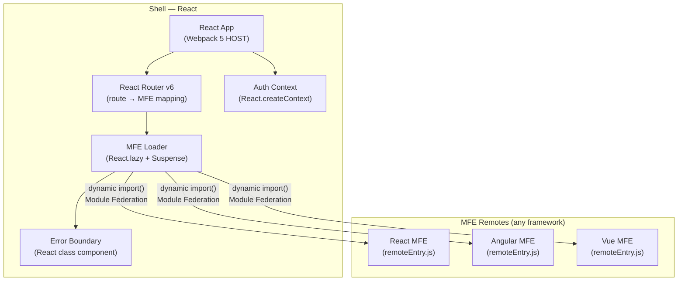
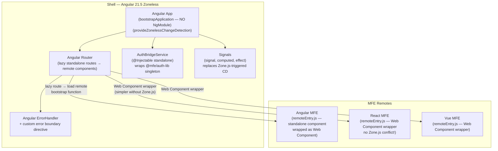
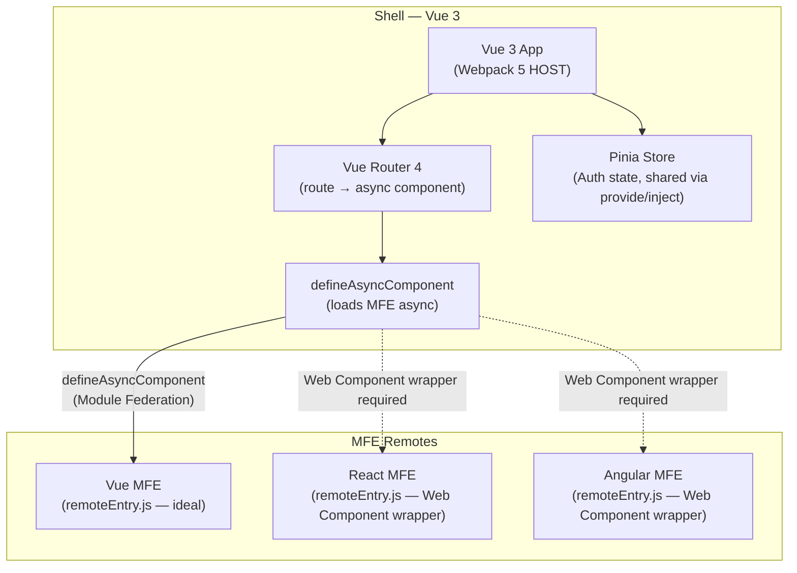
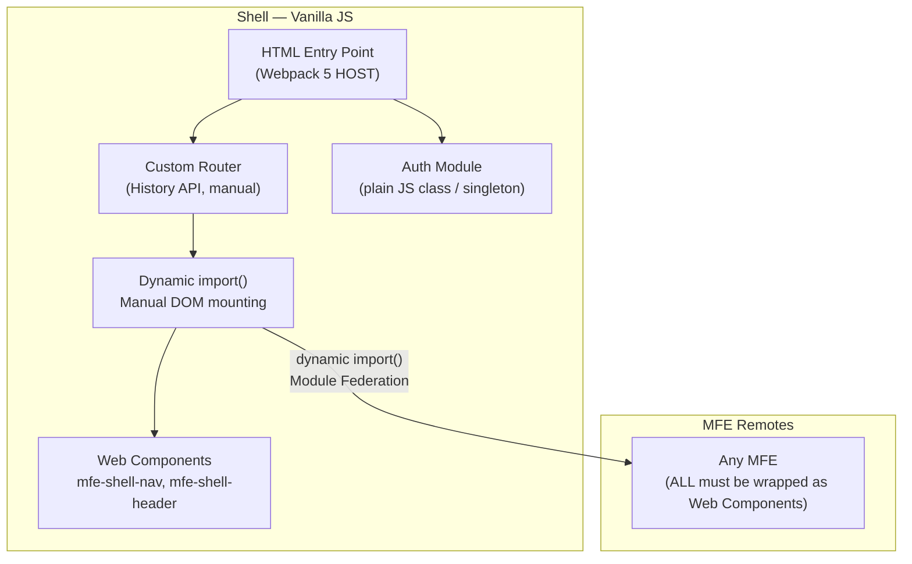
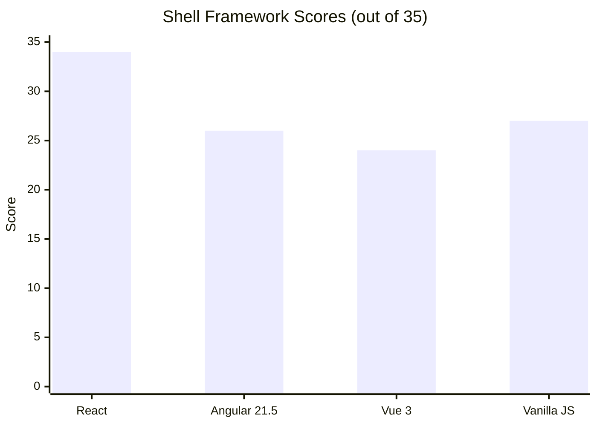

# Shell Framework Comparison — React vs Angular vs Vue vs Vanilla

> **Purpose**: Evaluate the best framework for the MFE Shell (Host/Container application) given our requirements: cross-framework MFE support, polyrepo, shared auth, Bootstrap 5, 50+ future apps.

---

## Evaluation Criteria

| #   | Criterion                         | Weight | Rationale                              |
| --- | --------------------------------- | ------ | -------------------------------------- |
| 1   | Module Federation maturity        | High   | Core technology of the platform        |
| 2   | Framework-agnostic MFE loading    | High   | Shell must load React/Angular/Vue MFEs |
| 3   | Bundle size / startup performance | Medium | Shell is loaded on every page          |
| 4   | Ecosystem & tooling               | Medium | Long-term maintenance, hiring pool     |
| 5   | Bootstrap 5 + SCSS integration    | Medium | Shared design system requirement       |
| 6   | Auth context sharing              | Medium | Token must be available to all MFEs    |
| 7   | Learning curve / team familiarity | Low    | POC — but matters for long-term        |
| 8   | Cross-framework isolation support | High   | Must not impose framework on MFEs      |

---

## Option A — React (Recommended)

### Overview

React is a UI library (not a full framework), making it lightweight and non-opinionated about routing, state, and build tooling. Combined with Webpack 5 Module Federation, it has the most mature MFE ecosystem.

### Architecture Fit



### Pros

- Largest Module Federation community — most examples, plugins, and guides are React-based
- `React.lazy()` + `Suspense` + Error Boundaries = first-class dynamic loading with fallback UI
- Shell can share `react` and `react-dom` as singletons — React MFEs reuse Shell's instance, no duplication
- Extremely lightweight shell bundle (React alone ~40KB gzipped)
- `createContext` provides a clean, framework-idiomatic auth context for React MFEs
- Non-React MFEs are mounted as Web Components — Shell doesn't care about their internals

### Cons

- React MFEs get a slight advantage (shared singleton) vs. Angular/Vue MFEs
- Requires understanding of React hooks for the auth context pattern
- Not a full framework — requires explicit routing library (React Router)

### Module Federation Config (Shell HOST)

```js
// shell/webpack.config.js (simplified)
new ModuleFederationPlugin({
  name: "shell",
  remotes: {}, // populated dynamically from mfe-manifest.json at runtime
  shared: {
    react: { singleton: true, requiredVersion: deps.react },
    "react-dom": { singleton: true, requiredVersion: deps["react-dom"] },
    "@mfe/auth-lib": { singleton: true, eager: true },
    "@mfe/web-components": { singleton: true },
  },
});
```

### Score

| Criterion                      | Score (1–5) |
| ------------------------------ | ----------- |
| Module Federation maturity     | 5           |
| Framework-agnostic MFE loading | 5           |
| Bundle size / startup          | 5           |
| Ecosystem & tooling            | 5           |
| Bootstrap 5 + SCSS             | 4           |
| Auth context sharing           | 5           |
| Cross-framework isolation      | 5           |
| **Total**                      | **34 / 35** |

---

## Option B — Angular 21.5 (Zoneless + Standalone)

> **Updated**: This evaluation uses Angular **21.5** with **standalone components** (no NgModule) and **zoneless change detection** (`provideZonelessChangeDetection()`). This is a significant upgrade from older Angular MFE patterns.

### What Changed in Angular 21.5

| Old Angular (≤ 16)                              | Angular 21.5                                                |
| ----------------------------------------------- | ----------------------------------------------------------- |
| `NgModule` required for every feature           | **Standalone components** — no NgModule                     |
| Zone.js mandatory — monkey-patches browser APIs | **Zoneless** — `provideZonelessChangeDetection()` stable    |
| Expose `NgModule` via Module Federation         | **Expose bootstrap function or standalone component**       |
| Zone.js conflicts with React/Vue MFEs           | **No Zone.js = no cross-framework interference**            |
| Heavy bundle (~250KB+ gzipped with Zone.js)     | **Lighter bundle (~160KB gzipped without Zone.js)**         |
| `@angular/elements` complex setup               | **`createApplication()` + `createCustomElement()` — clean** |

### Overview

Angular 21.5 removes its two biggest MFE weaknesses: Zone.js interference with cross-framework apps and NgModule complexity. It is now a legitimate Shell option, especially for teams that are Angular-first. However, it still carries a heavier bundle than React and its cross-framework loading story requires an extra wrapping step.

### Architecture Fit



### Zoneless Bootstrap Pattern (Angular 21.5 MFE)

```typescript
// mfe-angular-app/src/bootstrap.ts
import { createApplication } from "@angular/platform-browser";
import { provideZonelessChangeDetection } from "@angular/core";
import { createCustomElement } from "@angular/elements";
import { AppComponent } from "./app/app.component";

// Bootstrap Angular app as a Web Component — no Zone.js
export const bootstrapAngularMfe = async (hostElement: HTMLElement) => {
  const app = await createApplication({
    providers: [
      provideZonelessChangeDetection(), // ← No Zone.js!
    ],
  });
  const AngularElement = createCustomElement(AppComponent, {
    injector: app.injector,
  });
  if (!customElements.get("mfe-angular-app")) {
    customElements.define("mfe-angular-app", AngularElement);
  }
};
```

```typescript
// mfe-angular-app/src/app/app.component.ts — Standalone, Signals-based
import { Component, signal, computed } from "@angular/core";
import { authLib } from "@mfe/auth-lib";

@Component({
  selector: "mfe-angular-app",
  standalone: true, // ← No NgModule
  template: `
    <div class="mfe-angular-container">
      <h2>Angular 21.5 MFE (Zoneless)</h2>
      <p>User: {{ userName() }}</p>
    </div>
  `,
})
export class AppComponent {
  // Signals replace Zone.js-triggered change detection
  private _user = signal(authLib.getUser());
  userName = computed(() => this._user()?.name ?? "Guest");
}
```

### Pros

- **No Zone.js** — zero interference with React, Vue, or any non-Angular MFE running in the same browser
- **Standalone components** — expose a single `bootstrapFn` or component; no NgModule ceremony
- **Signals** — fine-grained reactivity without Zone.js overhead; predictable for MFE composability
- TypeScript-first, strong typing across Shell and Angular MFEs
- `@angular-architects/module-federation` v18+ fully supports standalone + zoneless
- `createCustomElement()` + `createApplication()` makes Angular-as-Web-Component clean and self-contained

### Cons

- Bundle still heavier than React (~160KB gzipped without Zone.js vs React ~40KB)
- Angular DI system is Angular-specific — auth-lib must be bridged via a service wrapper (1-time setup)
- Cross-framework MFEs (React, Vue) still require Web Component wrapping (same effort as older Angular)
- Angular's biannual major versions require coordinated MFE upgrades if `strictVersion: true` is used
- Smaller Module Federation community than React — fewer standalone+zoneless MFE examples

### Module Federation Config (Shell HOST — Angular 21.5)

```js
// shell/webpack.config.js (via @angular-architects/module-federation)
new ModuleFederationPlugin({
  name: "shell",
  remotes: {}, // populated dynamically from mfe-manifest.json
  shared: share({
    "@angular/core": { singleton: true, strictVersion: false },
    "@angular/common": { singleton: true, strictVersion: false },
    "@angular/router": { singleton: true, strictVersion: false },
    "@angular/elements": { singleton: true },
    "@mfe/auth-lib": { singleton: true, eager: true },
    "@mfe/web-components": { singleton: true },
    // NO zone.js in shared — zoneless architecture
  }),
});
```

### Score

| Criterion                      | Score (1–5) | Note                                                              |
| ------------------------------ | ----------- | ----------------------------------------------------------------- |
| Module Federation maturity     | 4           | `@angular-architects/module-federation` v18+ supports standalone  |
| Framework-agnostic MFE loading | 3           | No Zone.js conflict; Web Component bridge still needed            |
| Bundle size / startup          | 3           | ~160KB gzipped (vs React ~40KB) — no Zone.js improvement          |
| Ecosystem & tooling            | 4           | Strong Angular ecosystem, fewer MFE standalone examples           |
| Bootstrap 5 + SCSS             | 4           | Native SCSS support, ViewEncapsulation options                    |
| Auth context sharing           | 4           | Works via auth-lib singleton; DI bridge is Angular-specific       |
| Cross-framework isolation      | 4           | **Zoneless removes the Zone.js interference** — major improvement |
| **Total**                      | **26 / 35** | _(was 22/35 with Zone.js + NgModule)_                             |

---

## Option C — Vue 3

### Overview

Vue 3 (with Vite or Webpack 5) is a lightweight progressive framework. Module Federation support exists via `@originjs/vite-plugin-federation` (Vite) or standard Webpack config.

### Architecture Fit



### Pros

- Lightweight shell (~50KB gzipped)
- Vue 3 Composition API + `provide/inject` is a clean pattern for auth sharing to Vue MFEs
- Excellent developer experience, low learning curve
- `defineAsyncComponent` maps cleanly to Module Federation remote loading

### Cons

- Module Federation ecosystem smaller than React's — fewer production examples
- Cross-framework support (React, Angular MFEs) requires the same Web Component bridging as Angular Shell
- Pinia auth store is Vue-specific — non-Vue MFEs cannot consume it natively (need Web Component event bridge)
- Less common in enterprise environments — smaller talent pool
- `@originjs/vite-plugin-federation` (Vite-based) is not 100% compatible with Webpack-based MFEs

### Score

| Criterion                      | Score (1–5)  |
| ------------------------------ | ------------ |
| Module Federation maturity     | 3            |
| Framework-agnostic MFE loading | 3            |
| Bundle size / startup          | 5            |
| Ecosystem & tooling            | 3            |
| Bootstrap 5 + SCSS             | 4            |
| Auth context sharing           | 3 (Vue-only) |
| Cross-framework isolation      | 3            |
| **Total**                      | **24 / 35**  |

---

## Option D — Vanilla JS / Web Components Only

### Overview

The Shell is built with no framework — just HTML, CSS, and native Web Components. Module Federation still works via Webpack 5. Maximum framework neutrality.

### Architecture Fit



### Pros

- Truly framework-neutral — no framework preference for any MFE
- Smallest possible Shell bundle
- Auth module is a plain JS singleton — accessible from any MFE via Module Federation shared

### Cons

- No reactive UI primitives — building a complex Shell layout (nav, breadcrumbs, notifications) in Vanilla JS is verbose and error-prone
- No component lifecycle management — must manage DOM manually
- ALL MFEs must expose Web Components (even React/Angular ones) — higher MFE onboarding cost
- No built-in error boundary — custom implementation required
- Hardest to maintain and scale as Shell grows

### Score

| Criterion                      | Score (1–5) |
| ------------------------------ | ----------- |
| Module Federation maturity     | 3           |
| Framework-agnostic MFE loading | 5           |
| Bundle size / startup          | 5           |
| Ecosystem & tooling            | 2           |
| Bootstrap 5 + SCSS             | 3           |
| Auth context sharing           | 4           |
| Cross-framework isolation      | 5           |
| **Total**                      | **27 / 35** |

---

## Comparison Summary



| Criterion                      |   React    |     Angular 21.5     |   Vue 3    |  Vanilla   |
| ------------------------------ | :--------: | :------------------: | :--------: | :--------: |
| Module Federation maturity     | ⭐⭐⭐⭐⭐ |       ⭐⭐⭐⭐       |   ⭐⭐⭐   |   ⭐⭐⭐   |
| Framework-agnostic MFE loading | ⭐⭐⭐⭐⭐ |        ⭐⭐⭐        |   ⭐⭐⭐   | ⭐⭐⭐⭐⭐ |
| Bundle size / startup          | ⭐⭐⭐⭐⭐ |        ⭐⭐⭐        | ⭐⭐⭐⭐⭐ | ⭐⭐⭐⭐⭐ |
| Ecosystem & tooling            | ⭐⭐⭐⭐⭐ |       ⭐⭐⭐⭐       |   ⭐⭐⭐   |    ⭐⭐    |
| Bootstrap 5 + SCSS             |  ⭐⭐⭐⭐  |       ⭐⭐⭐⭐       |  ⭐⭐⭐⭐  |   ⭐⭐⭐   |
| Auth context sharing           | ⭐⭐⭐⭐⭐ |       ⭐⭐⭐⭐       |   ⭐⭐⭐   |  ⭐⭐⭐⭐  |
| Cross-framework isolation      | ⭐⭐⭐⭐⭐ |       ⭐⭐⭐⭐       |   ⭐⭐⭐   | ⭐⭐⭐⭐⭐ |
| **Total**                      |   **34**   | **26** _(↑ from 22)_ |   **24**   |   **27**   |

---

## Decision

> **React is the recommended Shell framework** for this POC and production platform.

See [03-shell-framework-decision-adr.md](03-shell-framework-decision-adr.md) for the full Architecture Decision Record.

---

## Special Note: Single-SPA as an Alternative Orchestrator

[single-spa](https://single-spa.js.org/) is an alternative to a custom React Shell. It is framework-agnostic by design and supports React, Angular, Vue, and Vanilla MFEs natively. It can be combined with Webpack 5 Module Federation.

| Aspect                    | Custom React Shell   | single-spa                 |
| ------------------------- | -------------------- | -------------------------- |
| Framework neutrality      | Via Web Components   | Native (built-in)          |
| Learning curve            | Low (standard React) | Medium (new lifecycle API) |
| Routing                   | React Router         | single-spa router          |
| Module Federation support | Native               | Plugin-based               |
| Community                 | Larger               | Smaller (MFE-specific)     |
| Recommendation for POC    | Simpler to set up    | Overkill for POC           |

> **Conclusion**: Use a custom React Shell for this POC. If the platform grows to 50+ apps with diverse frameworks and teams, evaluate migrating to single-spa as the orchestrator layer.
>
> See [06-single-spa-nx-workspace-plan.md](06-single-spa-nx-workspace-plan.md) for the complete plan: Nx workspace structure, single-spa root config, per-framework lifecycle wiring, import map registry, polyrepo integration, and migration path from the current custom Shell.
