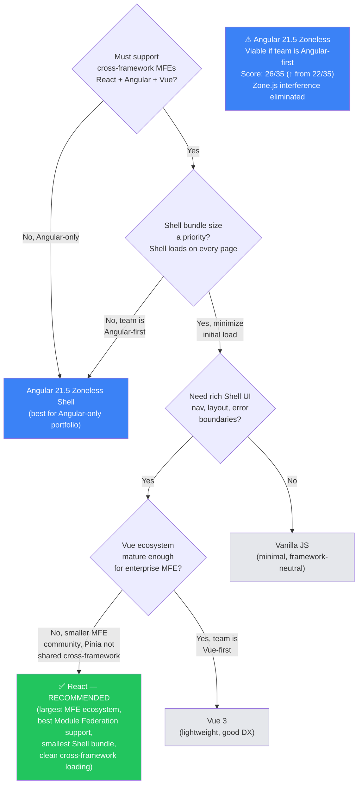

# ADR-001: Shell Framework Selection — React

> **Status**: Accepted  
> **Date**: 2026-04-20  
> **Deciders**: Solution Architecture Team  
> **Category**: Architecture Decision Record (ADR)

---

## Context

We are building a Micro Frontend (MFE) platform that must:

1. Act as a **Shell (Host/Container)** that loads and orchestrates 50+ independent MFE applications
2. Support **polyrepo** MFEs — each in its own Git repo, connected only via a URL (`remoteEntry.js`)
3. Support **cross-framework** MFEs — React, Angular, Vue, and potentially others
4. Provide a **shared design system** (Bootstrap 5 SCSS) and **Web Components** usable by all MFEs
5. Share a **single authentication context** (JWT token store) across all MFEs with no re-login
6. The Shell must **not force a framework choice** on any MFE team
7. Must scale without architectural changes as new MFEs are added

The Shell framework choice is critical because:

- It determines how easily cross-framework MFEs can be composed
- It affects the shared singleton strategy for auth and shared libraries
- It impacts the initial bundle size that every user downloads on every page load
- It shapes the developer experience for Shell maintainers long-term

We evaluated four options: React, Angular, Vue 3, and Vanilla JS.  
Full comparison is in [02-shell-framework-comparison.md](02-shell-framework-comparison.md).

---

## Decision

**We will use React (with Webpack 5 Module Federation) as the Shell (Host) framework.**

Specific versions:

- React `18.x`
- Webpack `5.x`
- React Router `6.x`
- webpack `ModuleFederationPlugin` (built-in)

---

## Decision Rationale

### Primary Reasons

**1. Largest Module Federation ecosystem**  
Webpack 5 Module Federation was first demonstrated with React. The majority of production examples, community plugins, and official documentation use React as the Shell. This means fewer unknowns and faster onboarding.

**2. First-class dynamic loading primitives**  
`React.lazy()` + `Suspense` + class-based Error Boundaries provide a complete solution for async MFE loading with loading states and crash isolation — no third-party packages needed.

**3. Framework-agnostic MFE composition**  
React Shell does not impose React on MFEs. Non-React MFEs (Angular, Vue) are wrapped in HTML Custom Elements (`customElements.define`) and mounted in a DOM container. The Shell only interacts with the DOM element — it has zero knowledge of the MFE's internal framework.

**4. Shared singleton auth pattern**  
React's `createContext` + a federated `@mfe/auth-lib` singleton covers both:

- React MFEs: consume `useAuth()` hook directly (shares the Shell's React context)
- Non-React MFEs: call `window.__mfe_auth.getToken()` or the federated module's exported function — no React dependency

**5. Smallest Shell bundle for cross-framework use case**  
React alone is ~40KB gzipped. Angular is ~250KB+. Vue is ~50KB. A smaller Shell bundle means faster initial page load for all users regardless of which MFE they're navigating to.

**6. No constraint on MFE framework adoption**  
Teams can choose Angular, Vue, Svelte, or plain JS for their MFE without any Shell changes. This is critical for the "50+ future apps" requirement where we cannot mandate a framework.

---

## Consequences

### Positive

- Fastest time-to-working-POC — most Module Federation tutorials use React Shell
- React MFEs can share `react` and `react-dom` as singletons, reducing their bundle size
- Error boundaries are natively supported — Shell is resilient to individual MFE crashes
- Auth context can be shared cleanly with both React MFEs (hooks) and non-React MFEs (exported function)
- Strong hiring pool — React is the most common frontend framework globally

### Negative / Trade-offs

- Angular MFEs get less "free" sharing than React MFEs — they cannot reuse the Shell's React instance (nor should they)
- Angular MFEs require wrapping in a Web Component to integrate cleanly — one-time setup per Angular MFE (~1 day effort)
- Shell maintainers need React knowledge — if the team is Angular-only, there is a learning curve

### Neutral

- Vue MFEs follow the same Web Component wrapping pattern as Angular MFEs
- The Shell itself does not prevent future migration to a different Shell framework — MFEs are isolated by design

---

## Alternatives Considered and Rejected

### Angular 21.5 Zoneless + Standalone (Rejected for Shell, Recommended for MFEs)

> **Re-evaluated**: Angular 21.5 with `provideZonelessChangeDetection()` and standalone components addresses the two biggest historical objections to Angular in an MFE Shell. This re-evaluation changes the recommendation nuance significantly.

**What changed with Angular 21.5:**

- **Zone.js removed** — `provideZonelessChangeDetection()` is stable in v21. The Zone.js cross-framework interference problem is eliminated. React, Vue, and other MFEs run side-by-side without Zone.js monkey-patching their lifecycle.
- **No NgModule** — Standalone components expose a single bootstrap function or component directly. Module Federation `exposes` is cleaner: `'./bootstrap': './src/bootstrap.ts'`
- **Signals** — Fine-grained reactivity without Zone.js. MFE state is predictable and isolated.
- **Score moved from 22 → 26 / 35** — see [02-shell-framework-comparison.md](02-shell-framework-comparison.md)

**Why Angular 21.5 is still rejected for the Shell (but only narrowly):**

- Bundle size is ~160KB gzipped (vs React ~40KB) — the Shell is loaded on every page load by every user across all 50+ MFEs. A 4x larger Shell bundle has real performance cost.
- Module Federation community and examples are still predominantly React-based — more unknowns for a POC.
- Cross-framework MFEs (React, Vue) still require a Web Component wrapper step — same effort as before.

**When to choose Angular 21.5 as Shell instead:**

- Team is Angular-first and has no React expertise — Angular 21.5 Shell is now a valid choice
- All or majority of MFEs are Angular — DI sharing and lazy routing are seamless Angular-to-Angular
- Server-side rendering is required — Angular Universal / SSR is more mature than React alternatives for enterprise

**Angular 21.5 as an MFE Remote (strongly recommended):**  
Angular 21.5 standalone + zoneless is the **recommended pattern for all Angular MFEs** in this platform, regardless of Shell choice. See [04-module-federation-wiring.md](04-module-federation-wiring.md) section 5 for the standalone bootstrap pattern.

### Vue 3 (Rejected)

Vue 3 is a valid lightweight option, but its Module Federation ecosystem is less mature. Pinia (Vue's auth store) is Vue-specific — non-Vue MFEs cannot consume it via Module Federation shared. Cross-framework MFEs need the same Web Component bridge as Angular. Rejected in favor of React's larger ecosystem and better Module Federation community support.

### Vanilla JS / Web Components (Rejected for Shell UI)

Maximum framework neutrality but impractical for building a complex Shell UI (navigation, layout, notifications, error handling). Every MFE would need to expose a Web Component — higher onboarding cost for MFE teams. No reactive primitives means more boilerplate. Rejected because Shell UI complexity justifies a framework. However, **Web Components remain the standard integration contract** between the Shell and non-React MFEs.

### Single-SPA (Deferred)

single-spa is a framework-agnostic MFE orchestrator that natively supports React, Angular, Vue, and others. It was considered but deferred because:

- Higher learning curve for POC (new lifecycle API on top of Module Federation)
- Overkill for 2–5 MFE POC; valuable at 20+ MFEs
- Can be introduced later without changing MFE internals

> Revisit single-spa when MFE count exceeds 20 and cross-framework complexity increases.

---

## Implementation Requirements from this Decision

| Requirement                    | Implementation                                                                                     |
| ------------------------------ | -------------------------------------------------------------------------------------------------- |
| Shell bootstraps as React app  | `shell/src/index.tsx` renders `<App />` with `ReactDOM.createRoot`                                 |
| Dynamic MFE loading            | `React.lazy(() => import('mfe/Component'))` via Module Federation                                  |
| Loading state per MFE          | `<Suspense fallback={<MfeLoadingSpinner />}>` wrapping each dynamic import                         |
| MFE crash isolation            | `<MfeErrorBoundary>` wrapping each `<Suspense>` — logs error, shows fallback                       |
| Auth context for React MFEs    | `AuthProvider` (React Context) at root; `useAuth()` hook consumed by React MFEs                    |
| Auth access for non-React MFEs | `@mfe/auth-lib` exported as a plain JS module with `getToken()`, `getUser()` — federated singleton |
| Angular/Vue MFE mounting       | Shell renders `<mfe-angular-app />` or `<mfe-vue-app />` custom element in a `div` container       |
| Routing                        | React Router v6 with `<Routes>` — each route mapped to an MFE name from the manifest               |

---

## Review Schedule

This decision should be reviewed when:

- MFE count reaches 20+ and cross-framework complexity increases (evaluate single-spa)
- A new requirement mandates server-side rendering (evaluate Next.js as Shell)
- The team shifts to a predominantly Angular or Vue-only MFE portfolio (re-evaluate Shell framework alignment)
