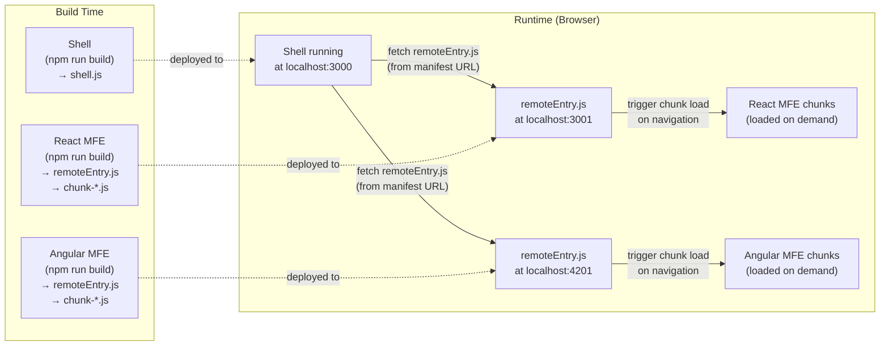
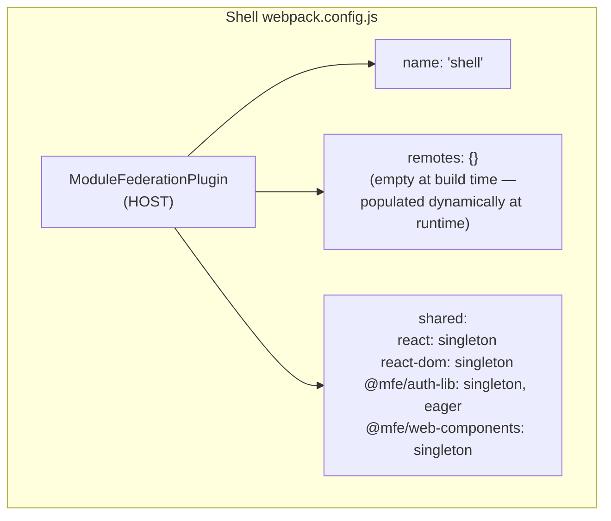
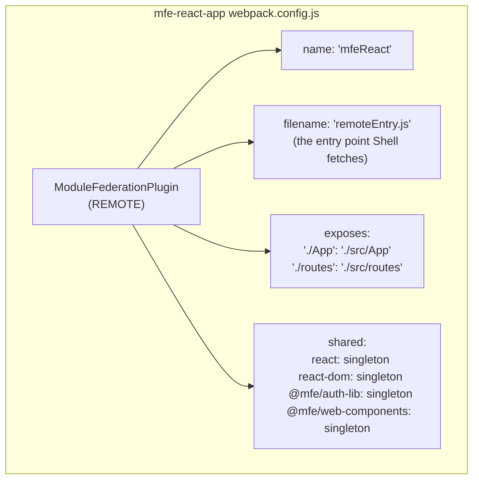
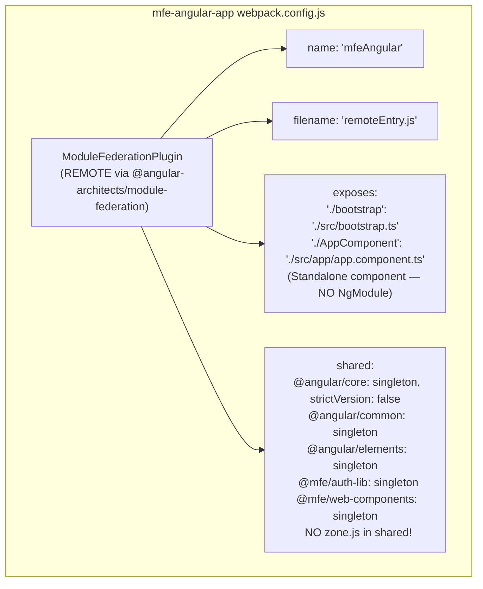
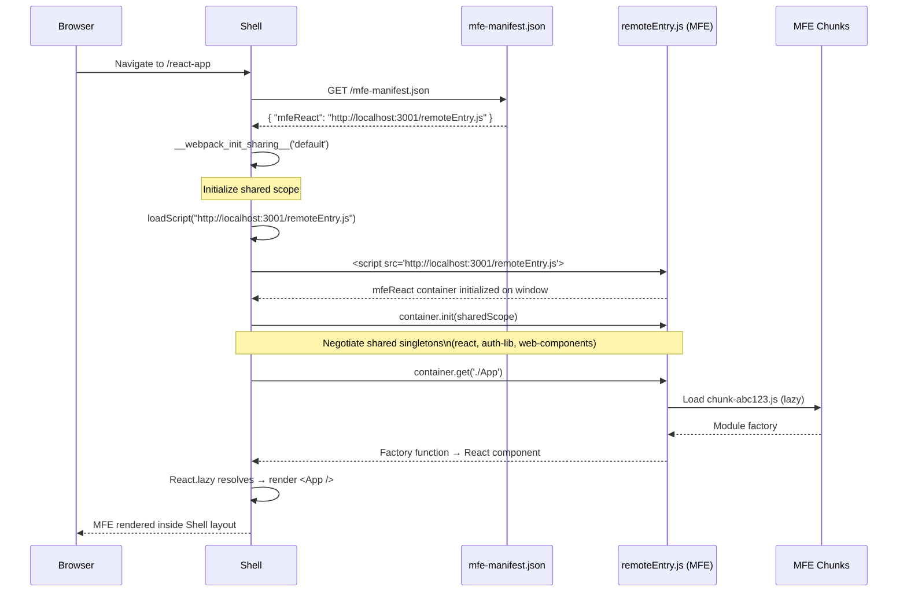
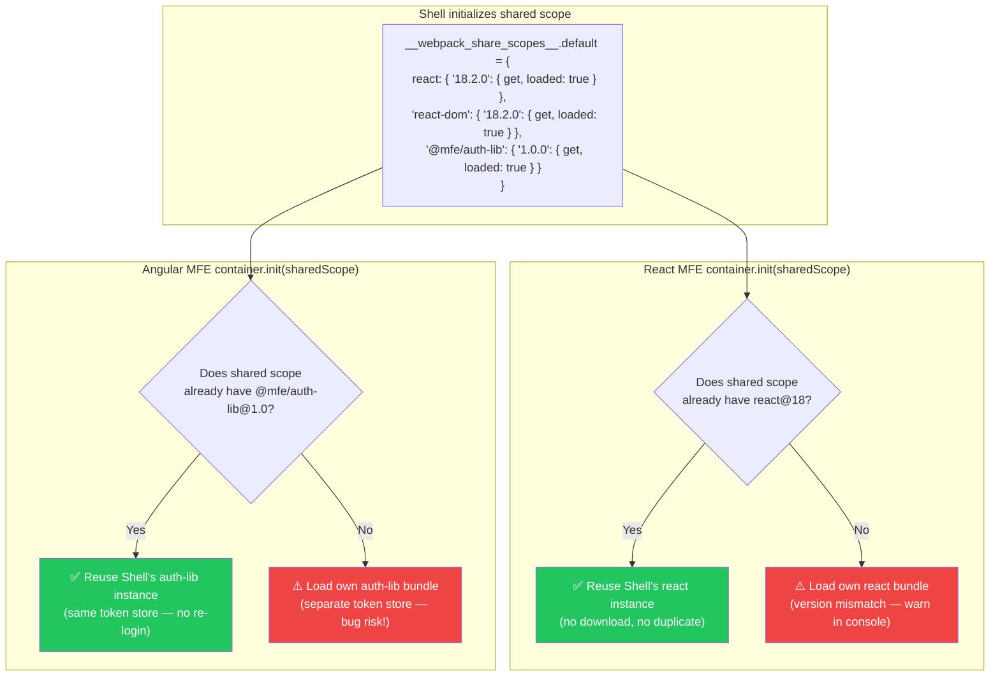
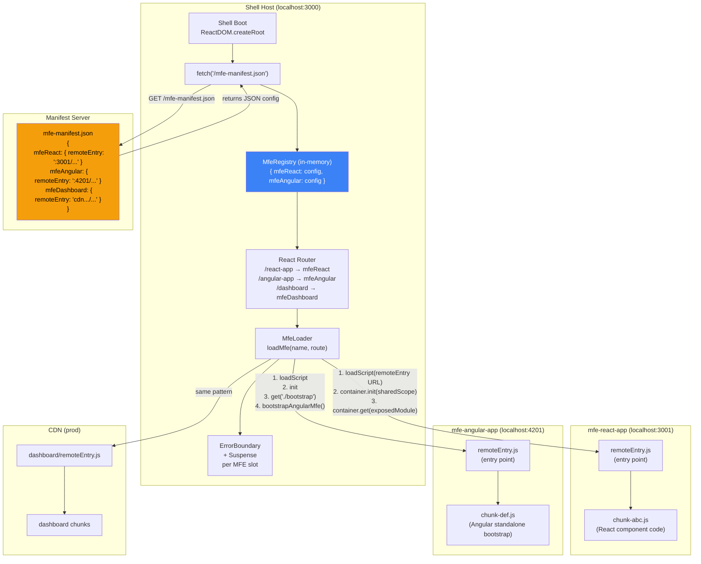
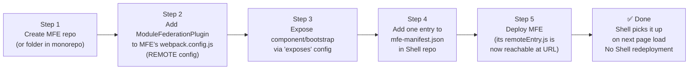
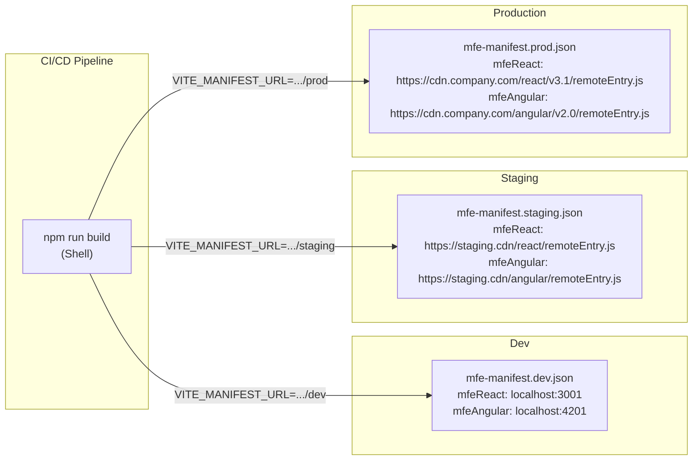
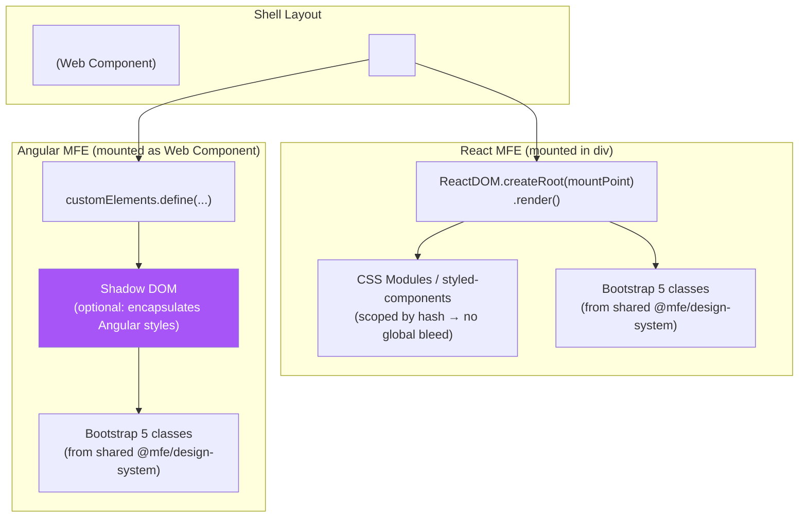

# Module Federation — Deep-Dive Wiring & Diagrams

> **Purpose**: Explain exactly how Webpack 5 Module Federation connects the Shell to polyrepo MFEs, how shared singletons work, and how the MFE manifest enables dynamic runtime registration.

---

## 1. What is Module Federation?

Module Federation (MF) is a Webpack 5 built-in feature that allows one JavaScript application (the **Host/Shell**) to load code from another separately deployed application (a **Remote/MFE**) **at runtime**, without static imports or bundling that code into the Host.



---

## 2. Module Federation Roles

| Role       | Config                                  | Who Uses It           |
| ---------- | --------------------------------------- | --------------------- |
| **HOST**   | `name`, `remotes`, `shared`             | Shell only            |
| **REMOTE** | `name`, `filename`, `exposes`, `shared` | Each MFE              |
| **SHARED** | `shared: { lib: { singleton } }`        | Both Host and Remotes |

---

## 3. Shell HOST Configuration



**Key**: `remotes` is intentionally empty at build time. The Shell loads MFEs dynamically at runtime from `mfe-manifest.json`. This is the pattern that enables adding new MFEs without redeploying the Shell.

```js
// shell/webpack.config.js
const { ModuleFederationPlugin } = require("webpack").container;
const deps = require("./package.json").dependencies;

module.exports = {
  plugins: [
    new ModuleFederationPlugin({
      name: "shell",
      remotes: {}, // ← intentionally empty; populated at runtime
      shared: {
        react: {
          singleton: true,
          requiredVersion: deps.react,
          eager: true, // Shell owns the instance
        },
        "react-dom": {
          singleton: true,
          requiredVersion: deps["react-dom"],
          eager: true,
        },
        "@mfe/auth-lib": {
          singleton: true,
          eager: true, // auth-lib initializes before any MFE loads
        },
        "@mfe/web-components": {
          singleton: true,
        },
      },
    }),
  ],
};
```

---

## 4. React MFE REMOTE Configuration



```js
// mfe-react-app/webpack.config.js
new ModuleFederationPlugin({
  name: "mfeReact",
  filename: "remoteEntry.js",
  exposes: {
    "./App": "./src/App",
    "./routes": "./src/routes/index",
  },
  shared: {
    react: { singleton: true, requiredVersion: deps.react },
    "react-dom": { singleton: true, requiredVersion: deps["react-dom"] },
    "@mfe/auth-lib": { singleton: true },
    "@mfe/web-components": { singleton: true },
  },
});
```

---

## 5. Angular 21.5 MFE REMOTE Configuration (Zoneless + Standalone)

> **Angular 21.5 pattern**: No NgModule. Expose a standalone `bootstrap` function that registers the Angular app as a Web Component using `createApplication()` + `createCustomElement()`. No Zone.js — zero cross-framework interference.



### webpack.config.js — Full Config

```js
// mfe-angular-app/webpack.config.js
const {
  shareAll,
  withModuleFederationPlugin,
} = require("@angular-architects/module-federation/webpack");

module.exports = withModuleFederationPlugin({
  name: "mfeAngular",
  filename: "remoteEntry.js",
  exposes: {
    // Expose standalone bootstrap function (NOT an NgModule)
    "./bootstrap": "./src/bootstrap.ts",
    // Optionally expose individual standalone components
    "./AppComponent": "./src/app/app.component.ts",
  },
  shared: {
    "@angular/core": { singleton: true, strictVersion: false },
    "@angular/common": { singleton: true, strictVersion: false },
    "@angular/router": { singleton: true, strictVersion: false },
    "@angular/elements": { singleton: true },
    "@mfe/auth-lib": { singleton: true },
    "@mfe/web-components": { singleton: true },
    // ⛔ DO NOT add zone.js here — zoneless architecture
  },
});
```

### bootstrap.ts — Standalone + Zoneless + Web Component

```typescript
// mfe-angular-app/src/bootstrap.ts
import { createApplication } from "@angular/platform-browser";
import { provideZonelessChangeDetection } from "@angular/core";
import { provideRouter } from "@angular/router";
import { createCustomElement } from "@angular/elements";
import { AppComponent } from "./app/app.component";
import { mfeRoutes } from "./app/app.routes";

/**
 * Called by the Shell's MFE loader.
 * Registers <mfe-angular-app> as a custom element — no Zone.js.
 */
export const bootstrapAngularMfe = async (): Promise<void> => {
  if (customElements.get("mfe-angular-app")) return; // idempotent

  const app = await createApplication({
    providers: [
      provideZonelessChangeDetection(), // ← Angular 21.5 key change
      provideRouter(mfeRoutes),
    ],
  });

  const AngularElement = createCustomElement(AppComponent, {
    injector: app.injector,
  });

  customElements.define("mfe-angular-app", AngularElement);
};
```

### app.component.ts — Standalone, Signals-Based

```typescript
// mfe-angular-app/src/app/app.component.ts
import { Component, signal, computed, OnInit } from "@angular/core";
import { CommonModule } from "@angular/common";
import { authLib } from "@mfe/auth-lib"; // ← federated singleton, no re-login

@Component({
  selector: "mfe-angular-app",
  standalone: true, // ← No NgModule
  imports: [CommonModule],
  template: `
    <div class="container mfe-angular">
      <h2>Angular 21.5 MFE</h2>
      <p>
        Logged in as: <strong>{{ userName() }}</strong>
      </p>
      <!-- Bootstrap 5 classes work — from shared @mfe/design-system -->
      <button class="btn btn-primary">Angular Action</button>
      <mfe-button label="Web Component Button"></mfe-button>
    </div>
  `,
})
export class AppComponent implements OnInit {
  // Signals replace Zone.js change detection
  private _user = signal(authLib.getUser());
  userName = computed(() => this._user()?.name ?? "Guest");

  ngOnInit() {
    // Subscribe to token expiry — update signal reactively
    authLib.onTokenExpiry(() => this._user.set(null));
  }
}
```

### How Shell Loads the Angular MFE

```typescript
// shell/src/mfe-loader/loadMfe.ts — Angular-specific loader
import { loadMfe } from "./loadMfe";

// Shell loads the Angular bootstrap function via Module Federation
const angularMfe = await loadMfe(
  "/mfe-manifest.json",
  "mfeAngular",
  "./bootstrap",
);
await angularMfe.bootstrapAngularMfe(); // registers <mfe-angular-app> custom element

// Shell simply renders the custom element — framework-agnostic!
// React JSX: <mfe-angular-app />
// OR: document.getElementById('mfe-slot').innerHTML = '<mfe-angular-app />';
```

### Angular 21.5 vs Old Angular — MFE Diff

| | Old Angular (\u2264 16) | Angular 21.5 |\n|---|---|---|\n| Expose | `'./Module': NgModule` | `'./bootstrap': standalone fn` |\n| Bootstrap | `bootstrapModule(AppModule)` | `createApplication({ providers: [provideZonelessChangeDetection()] })` |\n| Change detection | Zone.js (monkey-patches DOM) | Signals (`signal()`, `computed()`) |\n| Web Component | Manual Zone-wrapped element | `createCustomElement()` — clean |\n| Shared scope | `zone.js` in shared | **No zone.js** |\n| Shell impact | Zone.js could break React MFEs | Zero cross-framework interference |

---

## 6. Dynamic MFE Loading at Runtime

This is the most important pattern — how the Shell loads MFEs without knowing them at build time.



### Runtime Loading Code Pattern

```js
// shell/src/mfe-loader/loadMfe.js

async function loadMfe(manifestUrl, mfeName, exposedModule) {
  // 1. Fetch the manifest
  const manifest = await fetch(manifestUrl).then((r) => r.json());
  const remoteUrl = manifest[mfeName];
  if (!remoteUrl) throw new Error(`MFE "${mfeName}" not found in manifest`);

  // 2. Load the remoteEntry.js script
  await loadScript(remoteUrl);

  // 3. Initialize shared scope
  await __webpack_init_sharing__("default");
  const container = window[mfeName];
  await container.init(__webpack_share_scopes__.default);

  // 4. Get the exposed module
  const factory = await container.get(exposedModule);
  return factory();
}

// Usage in React component
const ReactMfeApp = React.lazy(() =>
  loadMfe("/mfe-manifest.json", "mfeReact", "./App"),
);
```

---

## 7. Shared Singleton Negotiation

This diagram shows how Module Federation prevents loading two copies of React or auth-lib:



> **Rule**: All MFEs MUST include `@mfe/auth-lib` in their `shared` config with `singleton: true`. If any MFE omits this, it loads its own copy → separate token store → users appear logged out in that MFE.

---

## 8. MFE Manifest / Registry — Complete Guide

The **MFE Manifest** is the single source of truth that connects the Shell to every MFE at runtime. It is a JSON file served alongside the Shell. Adding a new MFE requires only editing this file — zero Shell code changes, zero redeployment.

---

### 8.1 Manifest JSON Schema

```json
// shell/public/mfe-manifest.json
{
  "$schema": "./mfe-manifest.schema.json",
  "version": "1.0",
  "mfes": {
    "mfeReact": {
      "remoteEntry": "http://localhost:3001/remoteEntry.js",
      "exposedModule": "./App",
      "framework": "react",
      "route": "/react-app",
      "displayName": "React Application",
      "description": "React 18 MFE — polyrepo example",
      "active": true
    },
    "mfeAngular": {
      "remoteEntry": "http://localhost:4201/remoteEntry.js",
      "exposedModule": "./bootstrap",
      "framework": "angular",
      "route": "/angular-app",
      "displayName": "Angular Application",
      "description": "Angular 21.5 Zoneless MFE — polyrepo example",
      "active": true
    },
    "mfeDashboard": {
      "remoteEntry": "https://cdn.company.com/dashboard/v2.1/remoteEntry.js",
      "exposedModule": "./App",
      "framework": "react",
      "route": "/dashboard",
      "displayName": "Analytics Dashboard",
      "description": "Shared dashboard — co-located in this repo",
      "active": true
    }
  }
}
```

**Field reference:**

| Field           | Required | Description                                                         |
| --------------- | -------- | ------------------------------------------------------------------- |
| `version`       | Yes      | Manifest schema version — for future validation                     |
| `mfes`          | Yes      | Map of MFE name → config                                            |
| `remoteEntry`   | Yes      | Full URL to `remoteEntry.js` — environment-specific                 |
| `exposedModule` | Yes      | Module path as defined in MFE's `exposes` config                    |
| `framework`     | Yes      | `react` \| `angular` \| `vue` \| `vanilla` — drives loader strategy |
| `route`         | Yes      | URL path the Shell registers for this MFE                           |
| `displayName`   | Yes      | Human-readable name for nav and dashboard                           |
| `active`        | Yes      | `false` = Shell skips this MFE (feature flag)                       |

---

### 8.2 Connection Diagram — Shell ↔ Manifest ↔ MFEs



---

### 8.3 Shell MFE Registry — Code

```typescript
// shell/src/mfe-loader/MfeRegistry.ts

export interface MfeConfig {
  remoteEntry: string;
  exposedModule: string;
  framework: "react" | "angular" | "vue" | "vanilla";
  route: string;
  displayName: string;
  description: string;
  active: boolean;
}

export interface MfeManifest {
  version: string;
  mfes: Record<string, MfeConfig>;
}

class MfeRegistryClass {
  private registry: Record<string, MfeConfig> = {};
  private loaded = false;

  async load(manifestUrl = "/mfe-manifest.json"): Promise<void> {
    if (this.loaded) return;
    const res = await fetch(manifestUrl);
    if (!res.ok) throw new Error(`Failed to load MFE manifest: ${res.status}`);
    const manifest: MfeManifest = await res.json();
    // Only register active MFEs
    Object.entries(manifest.mfes).forEach(([name, config]) => {
      if (config.active) this.registry[name] = config;
    });
    this.loaded = true;
  }

  get(name: string): MfeConfig | undefined {
    return this.registry[name];
  }

  getAll(): Record<string, MfeConfig> {
    return { ...this.registry };
  }

  getRoutes(): Array<{ path: string; mfeName: string }> {
    return Object.entries(this.registry).map(([name, config]) => ({
      path: config.route.replace(/^\//, ""),
      mfeName: name,
    }));
  }
}

// Singleton — shared across Shell
export const MfeRegistry = new MfeRegistryClass();
```

---

### 8.4 Shell MFE Loader — Code

```typescript
// shell/src/mfe-loader/loadMfe.ts

declare const __webpack_init_sharing__: (scope: string) => Promise<void>;
declare const __webpack_share_scopes__: { default: unknown };

/** Injects remoteEntry.js as a script tag — idempotent */
function loadScript(url: string): Promise<void> {
  return new Promise((resolve, reject) => {
    if (document.querySelector(`script[src="${url}"]`)) {
      resolve();
      return;
    }
    const script = document.createElement("script");
    script.src = url;
    script.type = "text/javascript";
    script.async = true;
    script.onload = () => resolve();
    script.onerror = () => reject(new Error(`Failed to load: ${url}`));
    document.head.appendChild(script);
  });
}

/** Load any MFE at runtime — framework-agnostic */
export async function loadMfe(mfeName: string, exposedModule: string) {
  const config = MfeRegistry.get(mfeName);
  if (!config) throw new Error(`MFE "${mfeName}" not found in registry`);

  // 1. Inject remoteEntry.js
  await loadScript(config.remoteEntry);

  // 2. Initialize shared scope (shared singletons)
  await __webpack_init_sharing__("default");
  const container = (window as any)[mfeName];
  if (!container) throw new Error(`Container "${mfeName}" not found on window`);
  await container.init(__webpack_share_scopes__.default);

  // 3. Get the exposed module factory
  const factory = await container.get(exposedModule);
  return factory();
}
```

---

### 8.5 Shell App Bootstrap + Route Registration

```tsx
// shell/src/app/App.tsx
import React, { useEffect, useState } from "react";
import { BrowserRouter, Routes, Route, Navigate } from "react-router-dom";
import { MfeRegistry } from "../mfe-loader/MfeRegistry";
import { MfePage } from "../mfe-loader/MfePage";
import { ShellNav } from "./ShellNav";
import { AuthProvider } from "../auth/AuthProvider";
import { LoadingScreen } from "./LoadingScreen";

export function App() {
  const [ready, setReady] = useState(false);

  useEffect(() => {
    // Load manifest once at boot — before rendering any routes
    MfeRegistry.load("/mfe-manifest.json").then(() => setReady(true));
  }, []);

  if (!ready) return <LoadingScreen />;

  const routes = MfeRegistry.getRoutes();

  return (
    <AuthProvider>
      <BrowserRouter>
        <ShellNav mfes={MfeRegistry.getAll()} />
        <main>
          <Routes>
            <Route
              path="/"
              element={<Navigate to={routes[0]?.path ?? "/"} replace />}
            />
            {routes.map(({ path, mfeName }) => (
              <Route
                key={mfeName}
                path={`${path}/*`}
                element={<MfePage mfeName={mfeName} />}
              />
            ))}
          </Routes>
        </main>
      </BrowserRouter>
    </AuthProvider>
  );
}
```

```tsx
// shell/src/mfe-loader/MfePage.tsx — renders any MFE with error boundary + suspense
import React, { Suspense, lazy } from "react";
import { MfeRegistry } from "./MfeRegistry";
import { loadMfe } from "./loadMfe";
import { MfeErrorBoundary } from "./MfeErrorBoundary";

interface Props {
  mfeName: string;
}

export function MfePage({ mfeName }: Props) {
  const config = MfeRegistry.get(mfeName)!;

  if (config.framework === "angular" || config.framework === "vue") {
    // Non-React: mount via Web Component
    return (
      <MfeErrorBoundary mfeName={mfeName}>
        <WebComponentMfe mfeName={mfeName} config={config} />
      </MfeErrorBoundary>
    );
  }

  // React: use React.lazy + Suspense
  const RemoteApp = lazy(() =>
    loadMfe(mfeName, config.exposedModule).then((m) => ({
      default: m.default ?? m,
    })),
  );

  return (
    <MfeErrorBoundary mfeName={mfeName}>
      <Suspense fallback={<div>Loading {config.displayName}...</div>}>
        <RemoteApp />
      </Suspense>
    </MfeErrorBoundary>
  );
}

function WebComponentMfe({
  mfeName,
  config,
}: {
  mfeName: string;
  config: any;
}) {
  const elRef = React.useRef<HTMLDivElement>(null);

  React.useEffect(() => {
    loadMfe(mfeName, config.exposedModule).then((mod) => {
      // For Angular: call bootstrapAngularMfe() to register the custom element
      if (mod.bootstrapAngularMfe) return mod.bootstrapAngularMfe();
      if (mod.bootstrapVueMfe) return mod.bootstrapVueMfe();
    });
  }, [mfeName]);

  // Shell renders the custom element tag — framework-agnostic
  const tagName = `mfe-${mfeName.replace(/^mfe/, "").toLowerCase()}-app`;
  return (
    <div
      ref={elRef}
      dangerouslySetInnerHTML={{ __html: `<${tagName}></${tagName}>` }}
    />
  );
}
```

---

### 8.6 How to Add a New MFE in 5 Steps



**Step-by-step:**

1. **Create the MFE** — New Git repo (polyrepo) or folder in this monorepo
2. **Configure Module Federation REMOTE**:
   ```js
   new ModuleFederationPlugin({
     name: "mfeMyNewApp",
     filename: "remoteEntry.js",
     exposes: { "./App": "./src/App" },
     shared: {
       "@mfe/auth-lib": { singleton: true },
       "@mfe/web-components": { singleton: true },
     },
   });
   ```
3. **Expose the entry point** — React: export default component. Angular: export `bootstrapAngularMfe` function.
4. **Register in manifest** — add to `shell/public/mfe-manifest.json`:
   ```json
   "mfeMyNewApp": {
     "remoteEntry": "http://localhost:3003/remoteEntry.js",
     "exposedModule": "./App",
     "framework": "react",
     "route": "/my-new-app",
     "displayName": "My New App",
     "active": true
   }
   ```
5. **Deploy the MFE** — host `remoteEntry.js` at the URL in the manifest. Shell automatically routes to it.

> **Zero Shell code changes. Zero Shell redeployment.** Update the manifest JSON and deploy the MFE.

---

### 8.7 Environment-Specific Manifests



The Shell reads the manifest URL from an environment variable:

```typescript
// shell/src/mfe-loader/MfeRegistry.ts
const MANIFEST_URL =
  process.env.REACT_APP_MFE_MANIFEST_URL ?? "/mfe-manifest.json";
await MfeRegistry.load(MANIFEST_URL);
```

Each environment has its own manifest file — MFE URLs point to environment-specific CDN paths. No Shell rebuild required to promote MFE versions between environments.

---

## 9. CSS Isolation Strategy



**Isolation levels:**
| MFE Type | CSS Isolation | Bootstrap Shared |
|---|---|---|
| React MFE | CSS Modules or styled-components | Yes (from shared design-system) |
| Angular MFE | ViewEncapsulation.ShadowDom | Yes (injected via `:host { }` styles) |
| Vue MFE | `<style scoped>` | Yes |

---

## 10. Port Allocation (Local Development)

| App              | Port | remoteEntry.js URL                     |
| ---------------- | ---- | -------------------------------------- |
| Shell            | 3000 | N/A (is the host)                      |
| mfe-react-app    | 3001 | `http://localhost:3001/remoteEntry.js` |
| mfe-angular-app  | 4201 | `http://localhost:4201/remoteEntry.js` |
| mfe-vue-app      | 3002 | `http://localhost:3002/remoteEntry.js` |
| shared CDN (dev) | 3010 | N/A (npm-linked or webpack alias)      |
