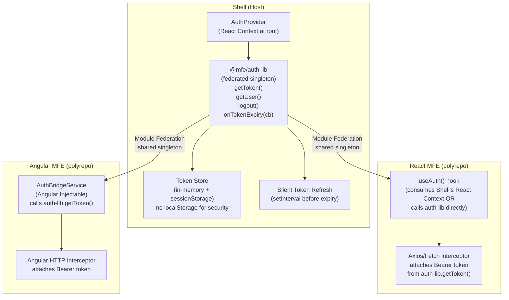
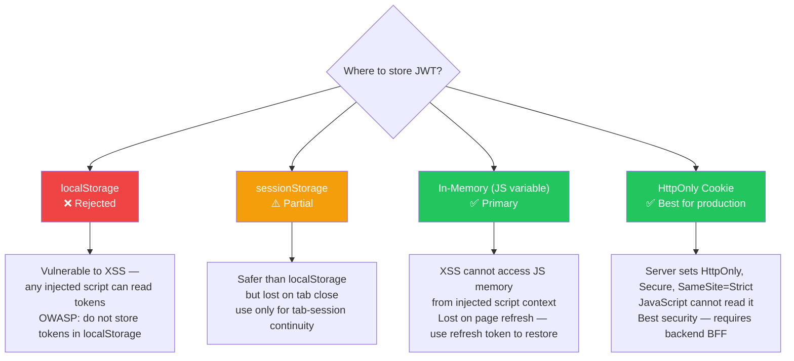
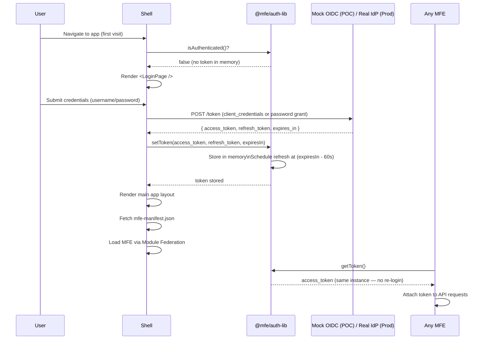
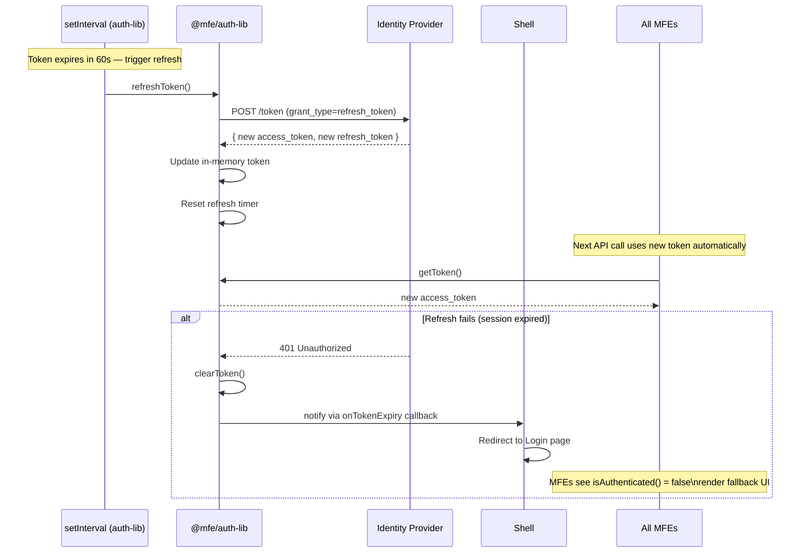
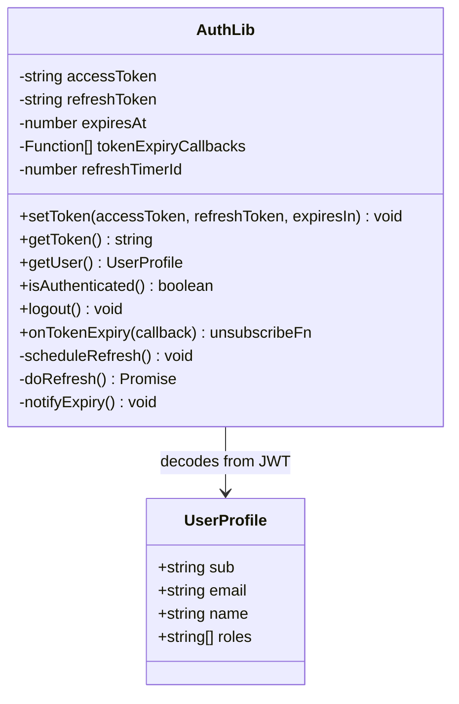
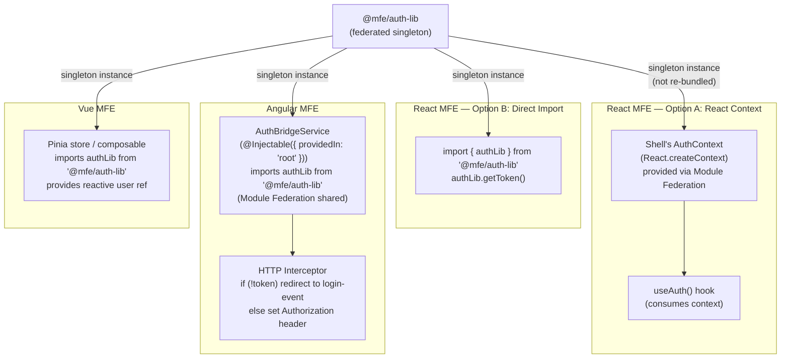
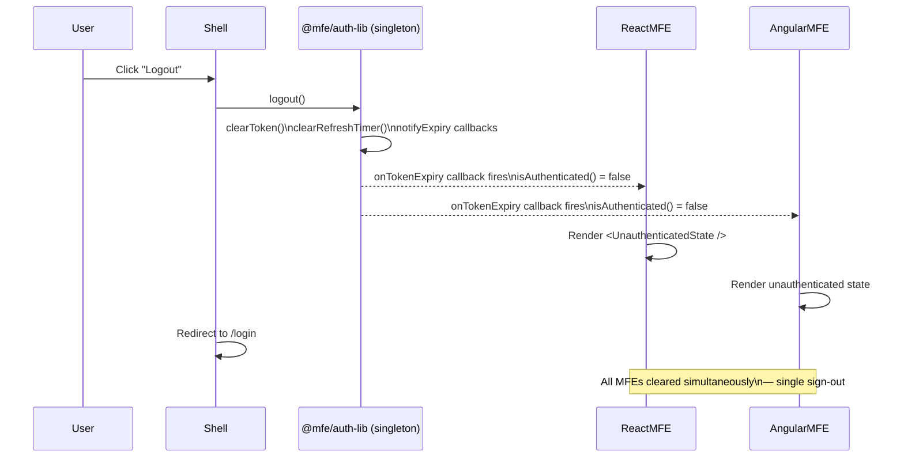
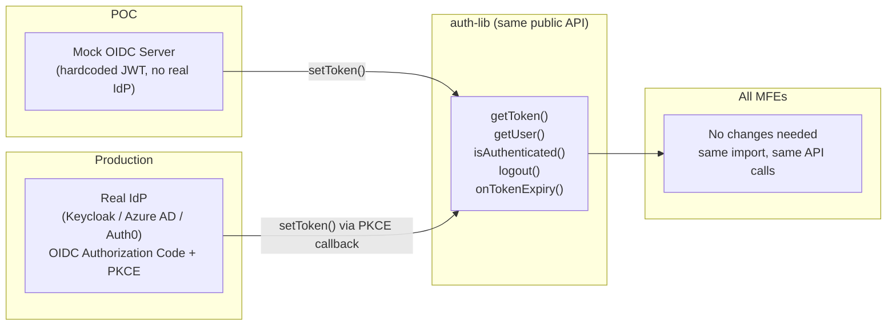

# Authentication Design — Shared Auth Across All MFEs

> **Purpose**: Define how authentication (JWT token management, login flow, token sharing) works across the Shell and all polyrepo MFEs — ensuring a single sign-on experience with no re-login between MFEs.

---

## 1. Auth Requirements

| #   | Requirement                                                                         | Priority |
| --- | ----------------------------------------------------------------------------------- | -------- |
| 1   | User logs in once — all MFEs (React, Angular, Vue) see the same authenticated state | Critical |
| 2   | JWT token must be accessible from any MFE regardless of framework                   | Critical |
| 3   | Token expiry / refresh must be handled centrally — MFEs do not manage refresh logic | Critical |
| 4   | Auth library must not be bundled twice (once in Shell, once in each MFE)            | High     |
| 5   | POC uses mock JWT; architecture must be OIDC-ready (Keycloak, Azure AD, Auth0)      | High     |
| 6   | MFEs must not store tokens themselves — they only read from the shared store        | High     |
| 7   | On logout, all MFEs must reflect logged-out state                                   | Medium   |

---

## 2. Auth Architecture Overview



---

## 3. Token Storage Decision



**POC Decision**: In-memory storage (JS variable in auth-lib). On page refresh, re-authenticate silently via refresh token (mocked in POC).  
**Production Decision**: HttpOnly Cookie via a Backend-for-Frontend (BFF) pattern.

---

## 4. Login / Authentication Flow



---

## 5. Silent Token Refresh Flow



---

## 6. auth-lib Module Design



### auth-lib Public API (TypeScript)

```ts
// shared/auth-lib/src/index.ts

export interface UserProfile {
  sub: string;
  email: string;
  name: string;
  roles: string[];
}

export const authLib = {
  setToken(accessToken: string, refreshToken: string, expiresIn: number): void,
  getToken(): string | null,
  getUser(): UserProfile | null,
  isAuthenticated(): boolean,
  logout(): void,
  onTokenExpiry(callback: () => void): () => void,  // returns unsubscribe fn
};

// React hook (only usable inside React MFEs)
export function useAuth(): { user: UserProfile | null; token: string | null; logout: () => void }
```

---

## 7. Cross-Framework Auth Consumption



**Rule**: Every MFE imports `@mfe/auth-lib` via `import { authLib } from '@mfe/auth-lib'`. Because Module Federation resolves this to the Shell's singleton instance, every call to `authLib.getToken()` returns the same token from the same in-memory store.

---

## 8. Logout Flow (Cross-MFE)



---

## 9. OIDC-Ready Interface

The POC uses a mock token issuer. The architecture is designed so that switching to a real OIDC provider (Keycloak, Azure AD B2C, Auth0) requires changing only `auth-lib` internals — the public API stays identical.



**Migration path**: Replace `auth-lib/src/oidcClient.ts` (the POC mock) with a real OIDC client library (e.g., `oidc-client-ts`). All MFEs remain unchanged.

---

## 10. Security Considerations

| Threat                                        | Mitigation                                                                               |
| --------------------------------------------- | ---------------------------------------------------------------------------------------- |
| XSS reads token from storage                  | Token in JS memory only — not in `localStorage`. `HttpOnly` cookies in production        |
| CSRF with cookies                             | `SameSite=Strict` on auth cookie + CSRF token for state-mutating requests                |
| Token leaked via URL                          | Never pass tokens in query strings or URL fragments                                      |
| MFE loads with stale token                    | auth-lib's `onTokenExpiry` callback triggers — MFE renders unauthenticated state         |
| Duplicate auth-lib bundles (two token stores) | `singleton: true` in all MFE webpack configs — enforced via shared scope negotiation     |
| MFE accesses another MFE's data               | Each MFE only uses its own API — auth token is scoped to the user, not to MFE boundaries |
