# Single-SPA in Nx Workspace — Architecture Plan

> **Purpose**: Plan how to migrate or greenfield the MFE platform using **single-spa** as the orchestration layer inside an **Nx monorepo workspace**, while preserving polyrepo connectivity, cross-framework support, shared design system, and shared auth.
>
> **When to use this plan**: When the app count exceeds ~20 MFEs, or when cross-framework lifecycle management becomes complex enough that a custom React Shell is insufficient.

---

## 1. Why single-spa + Nx?

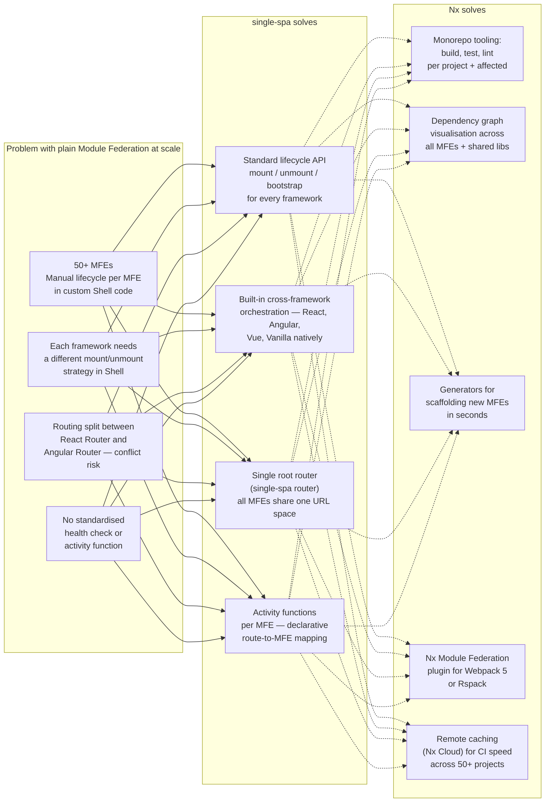

---

## 2. Key Concepts Before Implementation

### single-spa Terminology

| Term                  | Meaning                                                                               |
| --------------------- | ------------------------------------------------------------------------------------- |
| **Root Config**       | The HTML entry point + `registerApplication()` calls — replaces the custom Shell      |
| **Application**       | A full MFE (React, Angular, Vue) with `bootstrap`, `mount`, `unmount` lifecycle hooks |
| **Parcel**            | A reusable component without its own routing — like a shared widget                   |
| **Utility Module**    | A shared library (auth-lib, design-system) without any UI — loaded once               |
| **Activity Function** | A function `(location) => boolean` that tells single-spa when to activate an MFE      |
| **Import Map**        | A JSON file mapping module names to URLs — replaces `mfe-manifest.json`               |
| **System.js**         | Module loader used by single-spa to load MFEs from import maps at runtime             |

### Nx Terminology

| Term            | Meaning                                                                     |
| --------------- | --------------------------------------------------------------------------- |
| **Workspace**   | The root Nx monorepo folder                                                 |
| **Project**     | An app or lib inside the workspace (each has its own `project.json`)        |
| **Application** | A deployable project (Shell, each MFE)                                      |
| **Library**     | A shared, non-deployable project (`@mfe/auth-lib`, `@mfe/design-system`)    |
| **Tag**         | Labels on projects for lint rules (`scope:shell`, `scope:mfe`, `type:util`) |
| **Affected**    | `nx affected` — runs only tasks that changed since last commit              |

---

## 3. Target Workspace Structure

```
MFEDemo/                                  ← Nx workspace root
├── nx.json                               ← Nx configuration
├── package.json                          ← Root dependencies
├── tsconfig.base.json                    ← Shared TS paths
├── import-map.dev.json                   ← Import map (dev)
├── import-map.prod.json                  ← Import map (prod)
│
├── apps/
│   ├── root-config/                      ← single-spa Root Config (Shell replacement)
│   │   ├── src/
│   │   │   ├── index.ejs                 ← HTML entry with SystemJS + import map
│   │   │   └── root-config.ts            ← registerApplication() calls
│   │   └── project.json
│   │
│   ├── mfe-react-app/                    ← React MFE (co-located)
│   │   ├── src/
│   │   │   ├── main.tsx                  ← single-spa-react lifecycle exports
│   │   │   └── root.component.tsx
│   │   └── project.json
│   │
│   └── mfe-angular-app/                  ← Angular 21.5 Zoneless MFE (co-located)
│       ├── src/
│       │   ├── main.ts                   ← single-spa-angular lifecycle exports
│       │   └── app/app.component.ts      ← Standalone, Signals-based
│       └── project.json
│
├── libs/
│   ├── design-system/                    ← @mfe/design-system (Bootstrap 5 SCSS)
│   │   ├── src/
│   │   │   └── index.scss
│   │   └── project.json
│   │
│   ├── web-components/                   ← @mfe/web-components (Custom Elements)
│   │   ├── src/
│   │   │   └── index.ts
│   │   └── project.json
│   │
│   └── auth-lib/                         ← @mfe/auth-lib (single-spa utility module)
│       ├── src/
│       │   └── index.ts
│       └── project.json
│
└── docs/                                 ← This folder
```

**Polyrepo MFEs** (separate Git repos — NOT in this workspace) are registered only in the import map:

```json
{
  "imports": {
    "@mfe/external-react-app": "https://cdn.company.com/external-react/v1.2/main.js",
    "@mfe/external-angular-app": "https://cdn.company.com/external-angular/v1.0/main.js"
  }
}
```

---

## 4. Architecture Diagram

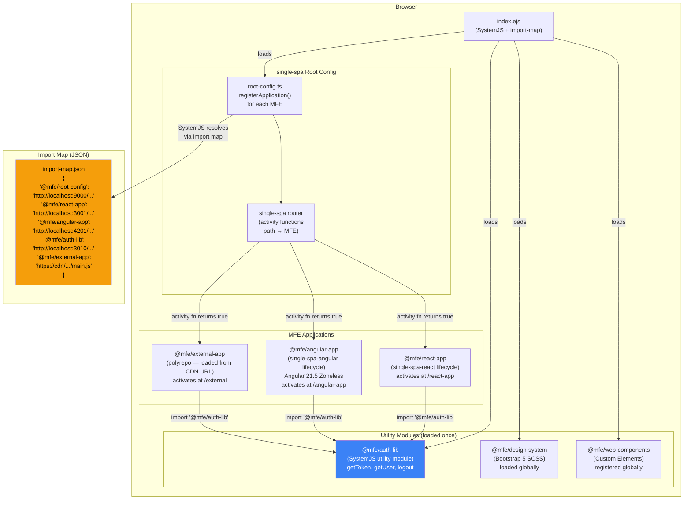

---

## 5. single-spa Lifecycle Flow

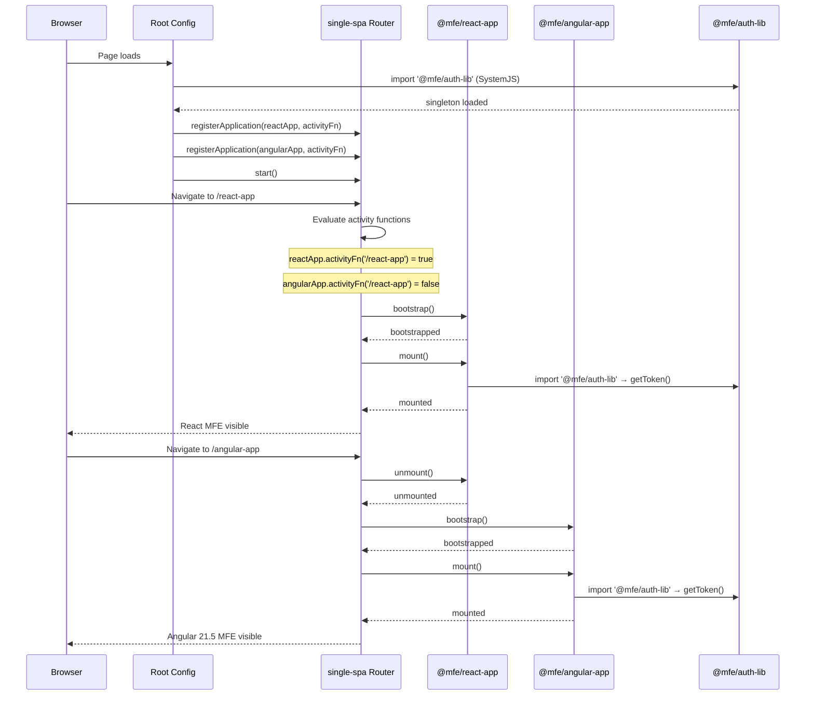

---

## 6. Nx Workspace Setup — Step by Step

### Phase 1 — Nx Workspace Init

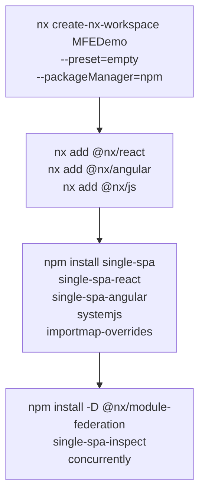

**Commands:**

```bash
# 1. Create workspace
npx create-nx-workspace@latest MFEDemo --preset=empty --packageManager=npm

# 2. Add framework plugins
nx add @nx/react
nx add @nx/angular
nx add @nx/js

# 3. Install single-spa runtime
npm install single-spa single-spa-react single-spa-angular systemjs importmap-overrides

# 4. Install dev tools
npm install -D @nx/module-federation concurrently single-spa-inspect
```

---

### Phase 2 — Generate Root Config (Shell)

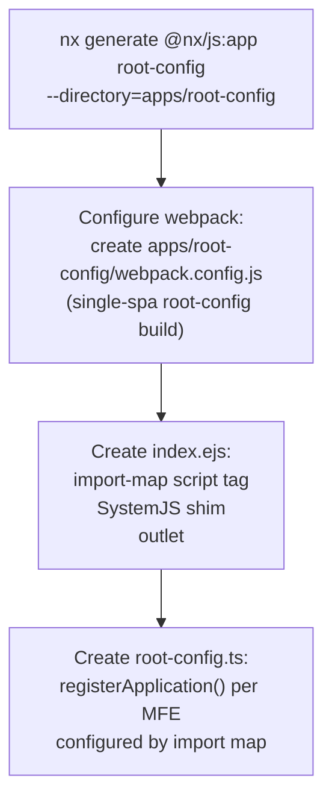

**`apps/root-config/src/index.ejs`:**

```html
<!DOCTYPE html>
<html lang="en">
  <head>
    <meta charset="UTF-8" />
    <meta name="viewport" content="width=device-width, initial-scale=1.0" />
    <title>MFE Platform</title>

    <!-- Import map: maps @mfe/* names to URLs -->
    <!-- In dev: loaded from import-map.dev.json -->
    <!-- In prod: loaded from CDN -->
    <script type="systemjs-importmap" src="/import-map.dev.json"></script>

    <!-- SystemJS module loader -->
    <script src="https://cdn.jsdelivr.net/npm/systemjs@6/dist/system.min.js"></script>
    <script src="https://cdn.jsdelivr.net/npm/systemjs@6/dist/extras/amd.min.js"></script>
    <script src="https://cdn.jsdelivr.net/npm/systemjs@6/dist/extras/named-exports.min.js"></script>

    <!-- importmap-overrides: lets devs override individual MFE URLs in browser -->
    <script src="https://cdn.jsdelivr.net/npm/importmap-overrides/dist/importmap-overrides.js"></script>
    <imo-dev-tools></imo-dev-tools>

    <!-- Bootstrap 5 CSS (from shared design-system CDN or local) -->
    <link rel="stylesheet" href="/shared/bootstrap.min.css" />
  </head>
  <body>
    <mfe-nav></mfe-nav>
    <!-- Parcel: shared nav Web Component -->

    <!-- single-spa mounts MFEs into this div -->
    <div id="single-spa-application"></div>

    <!-- Boot the Root Config -->
    <script>
      System.import("@mfe/root-config");
    </script>
  </body>
</html>
```

**`apps/root-config/src/root-config.ts`:**

```typescript
import { registerApplication, start } from "single-spa";

// Activity functions — declarative route → MFE mapping
const pathPrefix = (prefix: string) => (location: Location) =>
  location.pathname.startsWith(prefix);

registerApplication({
  name: "@mfe/react-app",
  app: () => System.import("@mfe/react-app"), // resolved via import map
  activeWhen: pathPrefix("/react-app"),
});

registerApplication({
  name: "@mfe/angular-app",
  app: () => System.import("@mfe/angular-app"),
  activeWhen: pathPrefix("/angular-app"),
});

registerApplication({
  name: "@mfe/external-app",
  app: () => System.import("@mfe/external-app"), // polyrepo: CDN URL in import map
  activeWhen: pathPrefix("/external"),
});

// single-spa takes control of routing
start({ urlRerouteOnly: true });
```

---

### Phase 3 — Generate React MFE

```bash
# Generate React app
nx generate @nx/react:app mfe-react-app --directory=apps/mfe-react-app --bundler=webpack
```

**`apps/mfe-react-app/src/main.tsx` — single-spa lifecycle exports:**

```typescript
import React from 'react';
import ReactDOM from 'react-dom/client';
import singleSpaReact from 'single-spa-react';
import { App } from './app/App';

const lifecycles = singleSpaReact({
  React,
  ReactDOM,
  rootComponent: App,
  errorBoundary(err) {
    return <div>Error in React MFE: {err.message}</div>;
  },
});

export const { bootstrap, mount, unmount } = lifecycles;
```

**`apps/mfe-react-app/webpack.config.js`:**

```js
const { composePlugins, withNx } = require("@nx/webpack");
const { withReact } = require("@nx/react");
const { ModuleFederationPlugin } = require("webpack").container;

module.exports = composePlugins(withNx(), withReact(), (config) => {
  config.output.libraryTarget = "system"; // ← SystemJS format for single-spa
  config.plugins.push(
    new ModuleFederationPlugin({
      name: "mfeReactApp",
      shared: {
        react: { singleton: true, requiredVersion: "^18.0.0" },
        "react-dom": { singleton: true },
        "@mfe/auth-lib": { singleton: true },
      },
    }),
  );
  return config;
});
```

---

### Phase 4 — Generate Angular 21.5 MFE (Zoneless)

```bash
# Generate Angular app
nx generate @nx/angular:app mfe-angular-app --directory=apps/mfe-angular-app --bundler=webpack
nx add @angular-architects/module-federation --project=mfe-angular-app
```

**`apps/mfe-angular-app/src/main.ts` — single-spa-angular lifecycle:**

```typescript
import { NgZone } from "@angular/core";
import { bootstrapApplication } from "@angular/platform-browser";
import { provideZonelessChangeDetection } from "@angular/core";
import { provideRouter } from "@angular/router";
import singleSpaAngular from "single-spa-angular";
import { AppComponent } from "./app/app.component";
import { mfeRoutes } from "./app/app.routes";

const lifecycles = singleSpaAngular({
  bootstrapFunction: (singleSpaProps) =>
    bootstrapApplication(AppComponent, {
      providers: [
        provideZonelessChangeDetection(), // ← Angular 21.5 zoneless
        provideRouter(mfeRoutes),
      ],
    }),
  template: "<mfe-angular-app />",
  // No NgZone — zoneless
  Router,
  NavigationStart,
  NgZone,
});

export const { bootstrap, mount, unmount } = lifecycles;
```

---

### Phase 5 — Shared Libraries as Utility Modules

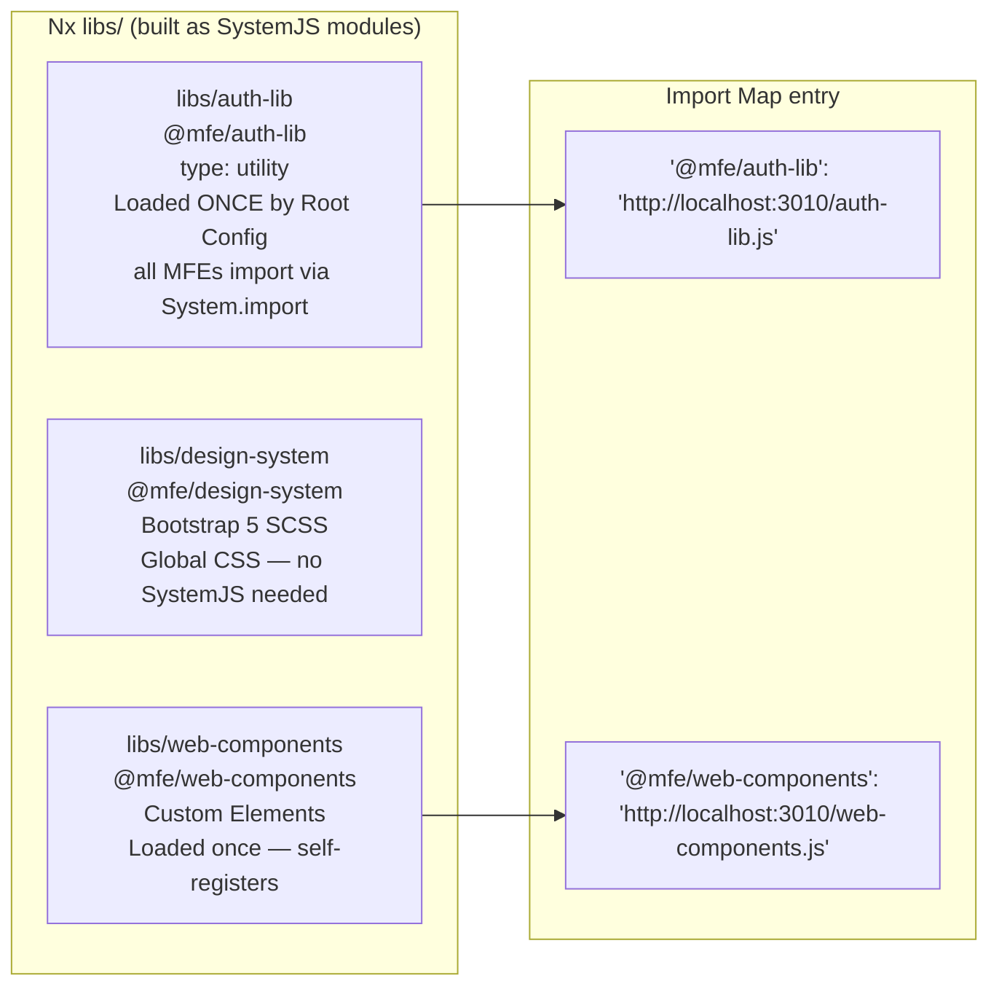

**`libs/auth-lib/src/index.ts`** — built as a SystemJS utility module:

```typescript
// This module is imported by ALL MFEs via: import('@mfe/auth-lib')
// single-spa loads it once — all MFEs share the same instance

export const authLib = {
  setToken(accessToken: string, refreshToken: string, expiresIn: number): void {
    /* ... */
  },
  getToken(): string | null {
    /* ... */
  },
  getUser(): UserProfile | null {
    /* ... */
  },
  isAuthenticated(): boolean {
    /* ... */
  },
  logout(): void {
    /* ... */
  },
  onTokenExpiry(callback: () => void): () => void {
    /* ... */
  },
};
```

**`libs/auth-lib/project.json` — build as SystemJS:**

```json
{
  "targets": {
    "build": {
      "executor": "@nx/webpack:webpack",
      "options": {
        "outputPath": "dist/libs/auth-lib",
        "outputFileName": "auth-lib.js",
        "outputHashing": "none",
        "libraryTarget": "system"
      }
    }
  }
}
```

---

### Phase 6 — Import Map Configuration

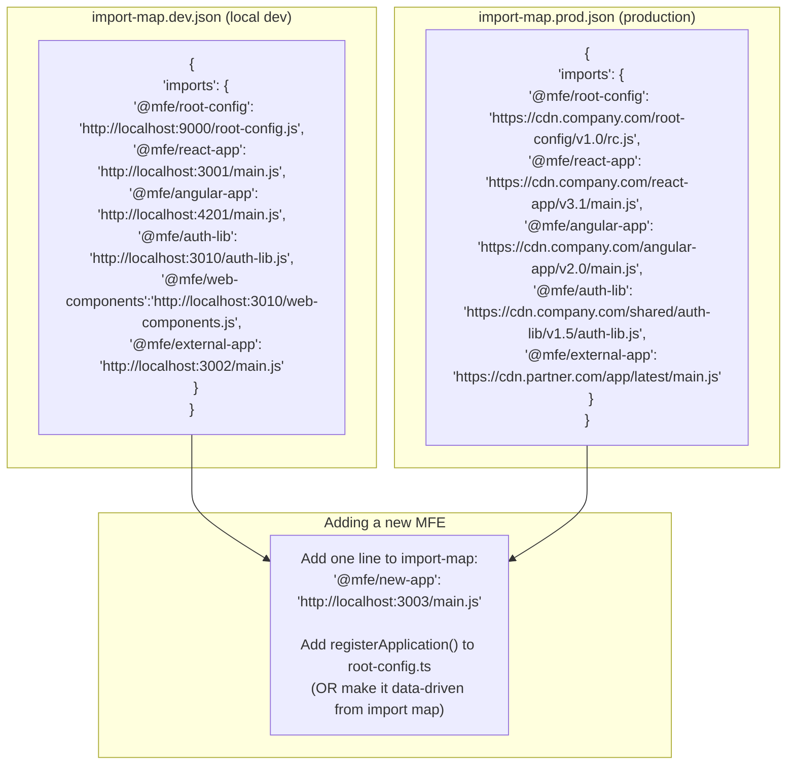

**`import-map.dev.json`:**

```json
{
  "imports": {
    "@mfe/root-config": "http://localhost:9000/root-config.js",
    "@mfe/react-app": "http://localhost:3001/main.js",
    "@mfe/angular-app": "http://localhost:4201/main.js",
    "@mfe/auth-lib": "http://localhost:3010/auth-lib.js",
    "@mfe/web-components": "http://localhost:3010/web-components.js",
    "single-spa": "https://cdn.jsdelivr.net/npm/single-spa@6/lib/system/single-spa.min.js",
    "rxjs": "https://cdn.jsdelivr.net/npm/rxjs@7/dist/bundles/rxjs.umd.min.js"
  }
}
```

---

### Phase 7 — Nx Project Tags & Dependency Rules

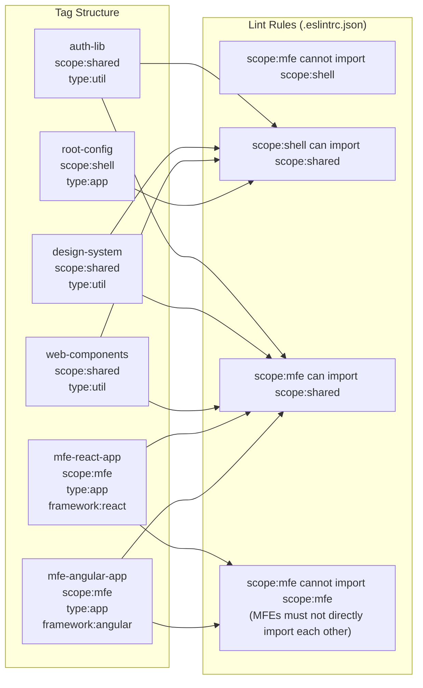

**`.eslintrc.json` (root) — enforce MFE boundaries:**

```json
{
  "rules": {
    "@nx/enforce-module-boundaries": [
      "error",
      {
        "enforceBuildableLibDependency": true,
        "depConstraints": [
          {
            "sourceTag": "scope:shell",
            "onlyDependOnLibsWithTags": ["scope:shared"]
          },
          {
            "sourceTag": "scope:mfe",
            "onlyDependOnLibsWithTags": ["scope:shared"]
          },
          {
            "sourceTag": "scope:shared",
            "onlyDependOnLibsWithTags": ["scope:shared"]
          }
        ]
      }
    ]
  }
}
```

---

### Phase 8 — Nx Serve (Dev — All Apps Concurrently)

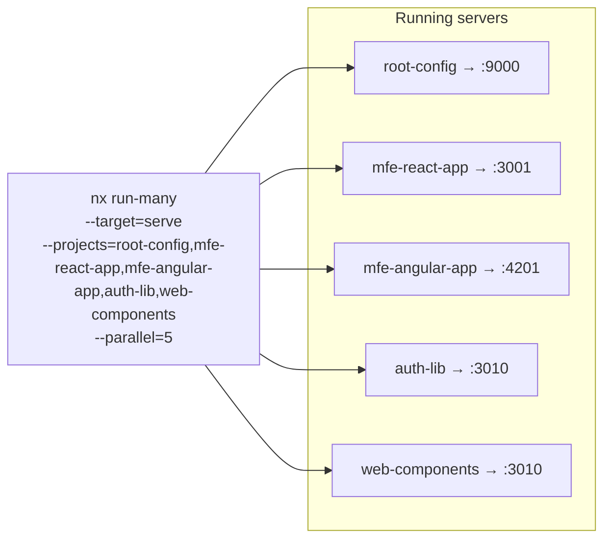

**`package.json` scripts:**

```json
{
  "scripts": {
    "start": "nx run-many --target=serve --parallel=5",
    "start:shell": "nx serve root-config",
    "start:react": "nx serve mfe-react-app",
    "start:angular": "nx serve mfe-angular-app",
    "build:all": "nx run-many --target=build --all",
    "build:affected": "nx affected --target=build",
    "test:affected": "nx affected --target=test",
    "graph": "nx graph"
  }
}
```

---

## 7. Adding a Polyrepo MFE — 4 Steps

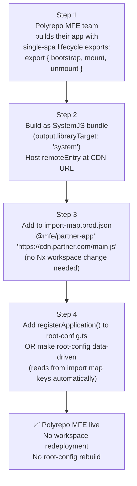

---

## 8. Comparison: Custom React Shell vs single-spa + Nx

| Aspect                   | Custom React Shell (current)   | single-spa + Nx                                       |
| ------------------------ | ------------------------------ | ----------------------------------------------------- |
| Shell framework          | React                          | Framework-agnostic                                    |
| MFE lifecycle management | Manual (React.lazy + Suspense) | Built-in (`bootstrap`, `mount`, `unmount`)            |
| Cross-framework MFEs     | Via Web Components             | Native — React, Angular, Vue all first-class          |
| Routing                  | React Router                   | single-spa router (activity functions)                |
| Module loader            | Webpack Module Federation      | SystemJS + Import Maps                                |
| MFE registry             | `mfe-manifest.json`            | `import-map.json`                                     |
| Shared libraries         | Module Federation shared scope | SystemJS utility modules                              |
| Monorepo tooling         | Manual                         | Nx (generators, affected, dep graph)                  |
| 50+ app scale            | Manual Shell code growth       | Declarative — add to import map + registerApplication |
| Dev experience           | Run 2–3 apps manually          | `nx run-many` runs all in parallel                    |
| Polyrepo support         | URL in manifest                | URL in import map                                     |
| When to adopt            | POC / < 20 MFEs                | > 20 MFEs / diverse framework teams                   |

---

## 9. Migration Path: Custom React Shell → single-spa + Nx

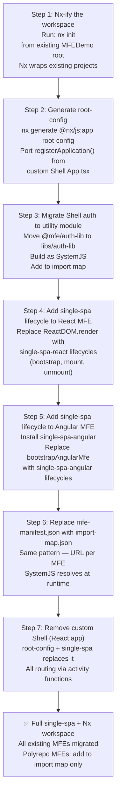

---

## 10. Summary: When to Use This Plan

| Trigger                                 | Action                                                               |
| --------------------------------------- | -------------------------------------------------------------------- |
| MFE count < 20                          | Stay with custom React Shell + `mfe-manifest.json` (current plan)    |
| MFE count reaches 20                    | Begin Nx-ifying the workspace (Step 1 of migration)                  |
| Cross-framework lifecycle issues appear | Add single-spa Root Config (Steps 2–5 of migration)                  |
| 50+ MFEs with diverse teams             | Full single-spa + Nx — import map is the registry, Nx handles builds |
| Polyrepo MFEs from external teams       | Both plans support it — import map URL is the contract               |
